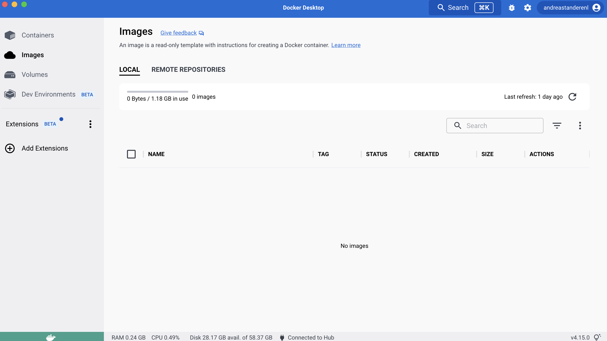
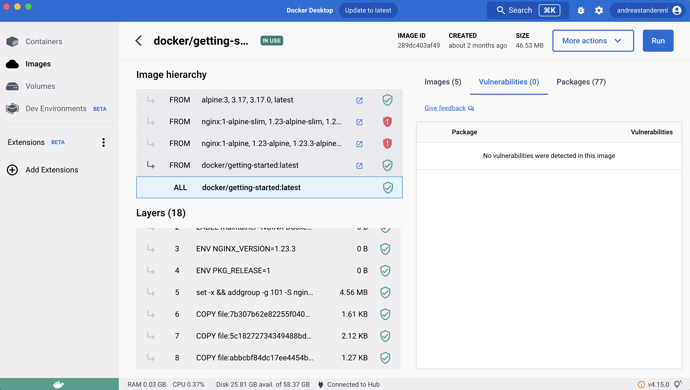

# Docker Desktop

If you do not yet have Docker Desktop downloaded, go [
here](https://www.docker.com/products/docker-desktop/) and
download the desktop suited for your hardware.

## What is Docker Desktop?

Docker Desktop is an application that includes all programs
needed for you to build and share containerized applications
on your machine. What is a _containerized application_ you
might ask? An application that is containerized can be any
application you like that you isolate to run in an
environment where you easily can control what versions
different dependencies uses and what environment variables
it should use. The environment can be on your physical local
machine or a remote machine. Usually you start running the
containerized application on your physical machine during
development and when features are ready to be deployed to
production the containerized application will reside on a
remote host.

The approach of containerizing an application starts by
making a **Dockerfile** which will be _built into an image_.
If then _running the image_ you will get a _running
container_
which you can access by an address and a port. Continue
reading for an explanation of how you can interact with
Docker Desktop to get information of your local and remote
images and containers.

## Images

As mentioned, images are the resulting unit you get when
telling Docker to build an image based on the content of a
Dockerfile. In most cases a Dockerfile includes one or
more `COPY` commands which moves your local files into the
Docker image along with some commands that should be
executed when the image is used to start a container.
Packing this information together inside an image allows for
easily sharing and running applications between physical
computers.



In Docker Desktop you can manage your images by locating to
the images tab. Clicking an image will show how the image
was built up based on other images, and how commands in the
Dockerfiles from these images result into different _layers_
.

<details>
<summary>Want to know more about layers?</summary>

### Layers

In order to understand exactly what a _layer_ is, lets first
make it clear that images are based on other images. And all
images are based on different commands which will be
explained in more
detail [later in the course](./04-dockerfile). Each time
Docker executes a command a new layer is made which is
actually the _difference_ between the image before and after
the command was executed.
</details>



## Containers

Also as mentioned, containers are the unit you get when
telling Docker to run an image. The commands stated in the
Dockerfile has made the foundation of how this container
will behave, such as:

- What command will be executed inside the container when
  you run the image.
- What commands will be executed while making the container.
- What will be the working directory that the commands are
  executed from.
- What environment variables it uses.
  to mention some characteristics.

In Docker Desktop you can see the containers that either run
or has been stopped on your machine.
Clicking into a container will show it's logs, environment
variables, resource usage, configuration and even a terminal
tab.


📝Try copying the command on the frontpage of Docker Desktop
when opening the Containers tab. Open your terminal and
enter the command.

```bash
docker run -d -p 80:80 docker/getting-started
```

### Task 1.1


## Volumes

These are storage areas available for containers and enables
persisting data through different life cycleses or between
containers.

## Resources

Click the cog icon in the top right and then _Resources_ to
manage the CPU and memory allocated to Docker Desktop.]()